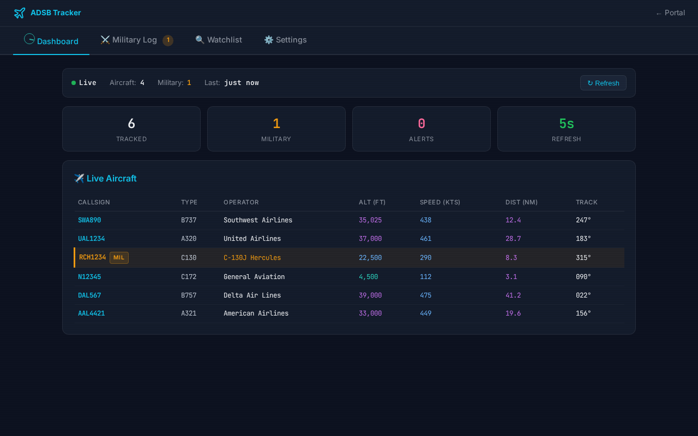
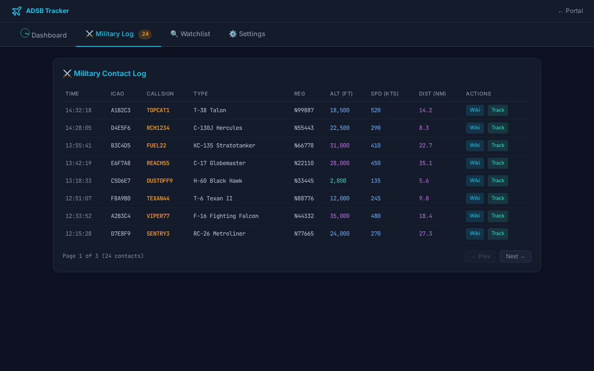

# Endurance Aircraft Tracker

**Real-time ADS-B aircraft tracking with military detection, watchlist alerts, and emergency squawk monitoring.**

[](https://opensource.org/licenses/MIT)
[](https://bun.sh/)
[](https://adsb.fi/)

A single-file Bun/TypeScript backend with a self-contained HTML frontend. Polls [ADSB.fi](https://adsb.fi/) for aircraft within configurable radii, automatically detects and logs military contacts, monitors emergency squawk codes (7500/7600/7700/7777), and sends Pushover alerts for watchlist matches.



---

## Features

### Live Aircraft Dashboard
- Real-time aircraft table with callsign, type, operator, altitude, speed, distance, and heading
- Military aircraft highlighted with orange accent and MIL badge
- Sortable columns, auto-refresh, manual refresh button
- Status bar with live/stale/error indicators
- Altitude color banding and distance proximity emphasis

### Military Contact Log
- Automatic detection via ADSB.fi `dbFlags` military bit
- Persistent SQLite logging with session tracking
- Wikipedia links for 60+ aircraft types (F-16, C-130, KC-135, B-52, etc.)
- Direct links to ADSB.fi globe tracker per aircraft
- Paginated history with contact detail view
- One-click "add to watchlist" from any military contact



### Watchlist System
- Match by hex code, type code, callsign (substring), or registration
- Pushover push notifications on detection
- 10-minute dedup window prevents alert spam
- Alert history with dismiss/dismiss-all
- Configurable watchlist radius (independent of tracking radius)

### Emergency Squawk Monitoring
- Detects 7500 (hijack), 7600 (NORDO), 7700 (emergency), 7777 (intercept)
- Independent squawk detection radius
- Pushover alerts with priority levels
- Squawk alert log with history

### Settings
- Configurable radii: all-aircraft, military, squawk, watchlist (1-250 NM each)
- Adjustable refresh interval (30-300 seconds)
- Pushover integration with test button
- Tracking statistics dashboard

---

## Quick Start

### Prerequisites

- [Bun](https://bun.sh/) 1.3.9+

### Install & Run

```bash
git clone https://github.com/OddDuck11/endurance-adsb.git
cd endurance-adsb

# Configure your location
cp .env.example .env
# Edit .env with your coordinates:
#   ADSB_HOME_LAT=40.7128
#   ADSB_HOME_LON=-74.0060

# Create data directory
mkdir -p data

# Run
bun run adsb-backend.ts
```

The backend starts on port **8081** by default. Open `index.html` in a browser pointed at the backend, or serve it with any static file server.

### Environment Variables

| Variable | Default | Description |
|----------|---------|-------------|
| `ADSB_HOME_LAT` | `0` | Your latitude for distance calculations |
| `ADSB_HOME_LON` | `0` | Your longitude for distance calculations |
| `ADSB_PORT` | `8081` | Backend API port |
| `ADSB_DB_PATH` | `./data/adsb.db` | SQLite database path |
| `ADSB_BACKUP_PATH` | `./data/adsb-db-backup.db` | Database backup path |

### Running as a Service (systemd)

```ini
# ~/.config/systemd/user/adsb-backend.service
[Unit]
Description=ADSB Tracker Backend
After=network.target

[Service]
Type=simple
WorkingDirectory=/path/to/endurance-adsb
ExecStart=/usr/local/bin/bun run adsb-backend.ts
Restart=on-failure
Environment=ADSB_HOME_LAT=YOUR_LAT
Environment=ADSB_HOME_LON=YOUR_LON

[Install]
WantedBy=default.target
```

```bash
systemctl --user daemon-reload
systemctl --user enable --now adsb-backend
```

---

## API Endpoints

All endpoints are under `/api/adsb/`.

| Method | Path | Description |
|--------|------|-------------|
| GET | `/healthz` | Health check with uptime and failure count |
| GET | `/status` | Full status including settings (keys masked) |
| GET | `/aircraft` | Live aircraft cache (sorted by distance) |
| GET | `/military?page=1&limit=50` | Paginated military contact log |
| GET | `/military/:id` | Single contact detail with sighting history |
| GET | `/watchlist` | All watchlist entries with alert counts |
| POST | `/watchlist` | Add watchlist entry (`match_type`, `match_value`, `label`) |
| DELETE | `/watchlist/:id` | Remove watchlist entry |
| POST | `/watchlist/add-from-contact` | Add military contact to watchlist by hex |
| GET | `/alerts` | Watchlist alert history |
| POST | `/alerts/dismiss` | Dismiss alert (`{id}` or `{all: true}`) |
| GET | `/squawk-alerts` | Squawk alert history |
| POST | `/squawk-alerts/dismiss` | Dismiss squawk alert |
| PUT | `/settings` | Update tracking settings |
| POST | `/pushover/test` | Send test Pushover notification |
| POST | `/fetch` | Trigger immediate data fetch |
| GET | `/stats` | Tracking statistics and top aircraft types |

---

## Architecture

```
endurance-adsb/
├── adsb-backend.ts        # Bun server — API, polling, SQLite, alerts
├── adsb-backend.test.ts   # Integration tests (requires running backend)
├── index.html             # Self-contained frontend (HTML/CSS/JS)
├── .env.example           # Environment variable template
├── LICENSE                # MIT
└── screenshots/           # Demo screenshots (fake data)
```

**Stack:** Bun + `bun:sqlite` + vanilla HTML/CSS/JS. No frameworks, no build step, no node_modules.

**Database tables:**
- `aircraft_cache` — current aircraft (rebuilt each poll cycle)
- `military_contacts` — historical military sightings with session grouping
- `watchlist` — user-defined match rules
- `watchlist_alerts` — triggered watchlist notifications
- `squawk_alerts` — emergency squawk detections
- `settings` — configurable parameters

**Data source:** [ADSB.fi OpenData API v3](https://opendata.adsb.fi/) — free, unfiltered, community-funded.

---

## Tests

```bash
# Start the backend first
bun run adsb-backend.ts &

# Run tests
bun test adsb-backend.test.ts
```

Tests validate API endpoint shapes, input validation, and error handling against the running server.

---

## License

MIT License. See [LICENSE](LICENSE).

---

## Acknowledgments

- [ADSB.fi](https://adsb.fi/) — free, community-funded aircraft tracking data
- The ADS-B feeder community for maintaining receiver networks worldwide

---

<p align="center">
  <em>"Do not go gentle into that good night"</em>
</p>
